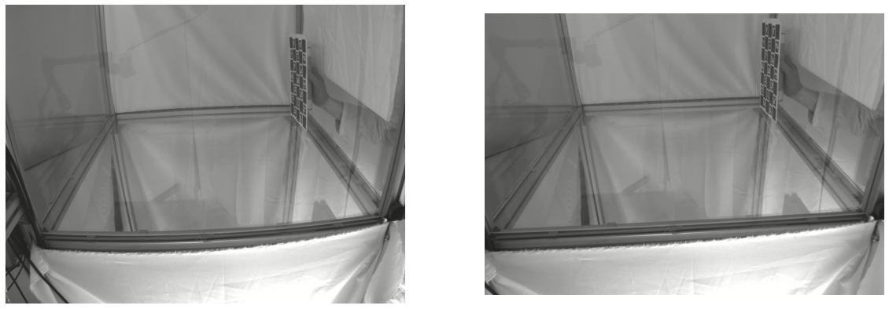

# Camera calibration intrinsic
Code for calibrating intrinisic properties from a camera using aniposelib.

We will simply rewamp the parts of code of [anipose](https://anipose.readthedocs.io) (Karashchuk et al., *Cell Reports*, 2021, doi: [10.1016/j.celrep.2021.109730](https://doi.org/10.1016/j.celrep.2021.109730)) that takes care of this part.

Example result, note that the curved aluminum bars in the original frame (left) are straight after the processing (right):


## Installation

Clone the repository and install the requirements:

```bash
$ git clone https://github.com/rfayat/camera_calibration_intrinsic
$ cd camera_calibration_intrinsic
$ pip install -r requirements.txt
```

## Generating the calibration board

### Configuration file
Parameters for the size, type of board, number of rows and columns in stored in the [config.toml](./config.toml) file which can be edited.

See [anipose documentation](https://anipose.readthedocs.io/en/latest/params.html#parameters-for-calibration) on the content of this configuration file. 

### Saving the board as a png

From the `camera_calibration_intrinsic` folder, simply run the [generate_board.py](./generate_board.py) script:

```bash
$ python -m generate_board
```

The calibration board is saved in the Desktop folder (this can be edited in the script).

## Grab the camera properties
Here we simplify the [anipose calibration script](https://github.com/lambdaloop/anipose/blob/dbebebba1e438f563f373245c2e546ece118fc65/anipose/calibrate.py) to only compute the intrinsic camera properties and save them as a toml file.


You'll need to record a calibration video using the calibration board generated at the previous step. Try to cover the full field of view of the camera and to show the board with diffent orientations. An example calibration video is available [here](https://drive.google.com/file/d/1GYCKgIv4uGF9z4vxeVpEbppbzZ-rK6Z1/view).

TODO example code

## Process a video
